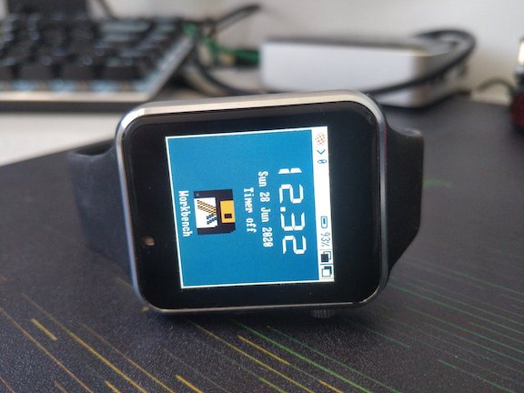

# AWatch
An ESP32 TTGO T-Watch (2019 edition) Amiga-inspired Countdown Timer Watch

2020 Model available for around £25/$25 from [Banggood](https://www.banggood.com/custlink/KGvvuczLO7).

**Now works with 2020 model (shown above). Check the defines in AWatch.ino.**

# Background
My partner asked if I could build her a timer countdown watch for measuring time outside during COVID lockdown. I had TTGO T-Watches knocking around and decided to give it a go. I'm a big fan of Amiga design patterns and wondered what it would be like to have a smartwatch inspired by the original Amiga Workbench. This is the result.

If you'd like to know more about the why/wtf I wrote this up at [Tales From The Dork Web](https://thedorkweb.substack.com/).

# Using the watch

The menus are all walked through in the video above. Use the top right button on your TTGO watch to bring up the screen and tap the disk to open the menu. Slide up and down through options and tap to select. If you're in the slide menu, use the square in the top left to go back to the main screen.

If to clear an alarm, go into timer and select cancel. If you play a song in the music section, it'll become your alarm song.

# How to use this repo

This is a single repo that contains everything watch related, so it's a bunch of Arduino projects. Install the Arduino IDE. Now copy the projects you're interested in to your Arduino sketches folder. If you're not sure, start with the AWatch folder. Install the following libraries before hitting compile/install.

* [TTGO's Watch Library](https://github.com/Xinyuan-LilyGO/TTGO_TWatch_Library)
* [ESP8266Audio](https://github.com/earlephilhower/ESP8266Audio) 
* [ESP8266SAM](https://github.com/earlephilhower/ESP8266SAM)

If I had a do-over I'd rewrite the whole thing for platformio or esp-idf properly using FreeRTOS to manage things and resolving the hardware issues I had. Alas, this was a fun PoC that got a bit out of hand.

# A note about quality, something sorely missing from this Proof-of-Concept
Please note, none of this is production quality, beta quality, or even alpha quality. The code I wrote is bad, like me makes poor life choices and you probably shouldn't use it for anything important.

That aside, it *mostly* works as a countdown timer with mod tunes, speech and a bunch of other nice things. It is buggy, expect edge cases. I use my own git repos for code normally so won't be updating this.

# Contributing

I would be delighted to receive pull requests, but am looking at writing something more like a proper watch OS from scratch and integrating features in for the long term. If you want to submit a pull request, please:

1. Ensure that you have appropriate checks for different watch versions in your code (e.g. [Steveway's PR](https://github.com/stevelord/AWatch/commit/45ee5e0bb282a495e5f8cf9ee8ec1f2348fe680a))
2. Test on a real watch to make sure that it works before issuing the pull request, and test any other functionality that may be impacted across different power modes (screen on and screen off for example)
3. Include an overview of the changes, your hardware (particularly if you're using daughterboards on the 2019 version) and what you've tested as part of your PR.

This makes testing and integrating your PR smoother for everyone. If you need a hand with the above, just ask for help.

## Thanks/Credits

I'd like to thank [LewisXhe](https://github.com/lewisxhe) and [Moononournation](https://github.com/moononournation) for their examples and libraries that I so horrifically butchered, @Bodmer for his [TFT_eSPI](https://github.com/Bodmer/TFT_eSPI) library, @earlephilhower for his [ESP8266Audio](https://github.com/earlephilhower/ESP8266Audio) and [ESP8266SAM](https://github.com/earlephilhower/ESP8266SAM) libraries and the [LVGL](https://github.com/lvgl/lvgl) team for [LVGL](https://lvgl.io/). Also [Tobozo](https://github.com/tobozo/M5Stack-Raytracer/blob/master/M5Stack-Raytracer.ino) for his M5Stack Raytracer project. I'd also like to thank @steveway for his pull request. If I get more I'll make a dedicated thanks section for contributors.
